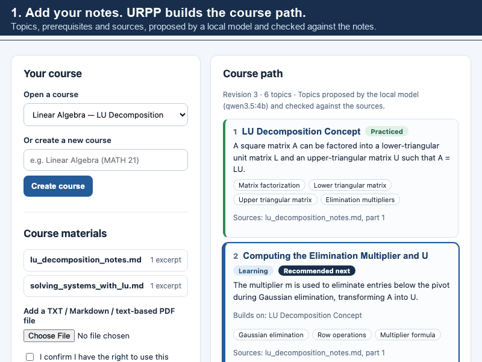
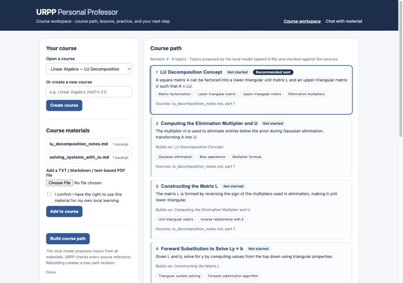
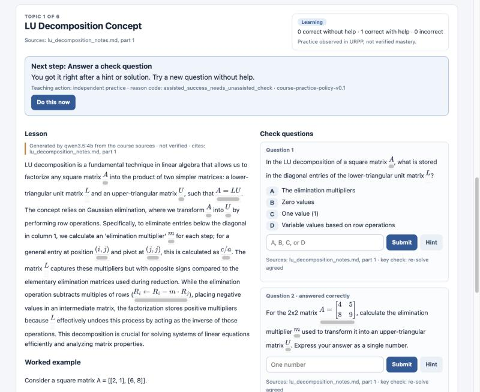
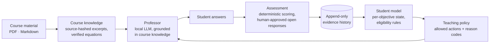

# URPP — Personal Professor

**An evidence-based AI tutor for university STEM courses: it decides what to teach next from what a student has actually shown, not from what a language model guesses.**


-555)


<p align="center">
  
</p>
<p align="center"><sub>Real screens from the local website: a course path built from two uploaded notes, a grounded lesson, and the next step after a correct answer <i>with a hint</i> (a new question without help, not "mastered"). One-page summary: <a href="docs/research_brief.md">research brief</a>.</sub></p>

---

## The research question

Most AI tutors are a chatbot with a course document attached. They answer well, but they cannot say *what the student has learned*, they treat "answered correctly after a hint" the same as mastery, and they decide what to do next by asking the same model that writes the explanation.

URPP asks:

> **Can an AI tutor that adapts to a student's *demonstrated* understanding help them learn more effectively and study more independently than a standard course chatbot?**

To make that question testable, URPP separates three jobs that a chatbot mixes together:

| Role | Job | Decided by |
|---|---|---|
| **Learning analyst** | Turn answers into evidence and estimate what the student knows per learning objective | Deterministic rules over an append-only evidence history |
| **Teaching policy** | Choose the next teaching action (diagnose, review, hint, practice, self-explain, transfer) | An explicit, versioned rule policy, with a reason code for every choice |
| **Professor** | Explain, using only the student's course material | A language model, which is **not allowed** to change the student's record |

## Progress against the user stories

URPP is built against a list of student user stories. The first tier now runs end to end on the local website ([design record](docs/33_course_workspace_tier1_v0.1.md)):

| Story | Status | What works |
|---|---|---|
| Understands the course from my materials | ✅ Tier 1 | Several documents (TXT, Markdown, PDF) in one course |
| Shows the full course path | ✅ Tier 1 | Ordered topics with prerequisites, key concepts, and sources; model-proposed, checked against the sources, with a deterministic fallback |
| Turns material into lessons and practice | ✅ Tier 1 | Grounded lesson and worked example per topic; numeric and multiple-choice check questions, kept only if the model re-solves them to the same answer |
| Adapts to my real performance | ✅ Tier 1 | The next step and its reason come from observed practice (correct, with or without a hint) and prerequisites |
| Shows why it decided | ✅ | Every next step shows its reason code and policy version |
| Remembers my learning | ✅ | Courses, lessons, questions, attempts, and progress survive restarts |
| Reliable formulas | 🟡 | Verified equations are shown exactly; explanations are labelled as not verified |
| Knows my level and prerequisites | 🟡 | Prerequisite order is enforced; no diagnostic of background knowledge yet |
| Daily plan, review schedule, re-planning | ⬜ Next | Tier 3 |
| How this course is graded, professor style | ⬜ Later | Tier 3–4 |

## Design principles

1. **Evidence history is the source of truth.** Student state is always *recomputed* from stored evidence, never edited directly.
2. **The language model proposes; code decides.** The model writes explanations. It cannot grant mastery, approve assessments, or skip eligibility rules.
3. **"Unknown" is a valid answer.** A correct answer after a hint, or with unknown conditions, does not count as independent mastery. The system says what it does not know.
4. **Every claim is traceable.** Source hashes, versioned rubrics and policies, frozen benchmark runs, and a written design record for each stage.

## See it work

**The course workspace** (`/course` on the local website):
1. Create a course and add your notes.
2. Build the course path.
3. Open a topic: the lesson is written from that topic's sources.
4. Answer check questions, with a hint if you want one.

URPP then tells you the next step and why:
- **Correct after a hint:** try a new question without help.
- **Two different questions correct without help:** the topic is marked practiced, and you move on.
- **Topic built on an unpracticed one:** URPP sends you there first.

Progress is labelled "practice observed in URPP, not verified mastery", because a correct answer can't rule out help from outside the app.

<p align="center">
  
  
</p>

**The evidence loop** (local numeric lesson, `scripts/run_local_numeric_lesson_v01.py`): the student asks for a hint, then answers correctly. URPP records both, keeps mastery `unknown` because the answer was assisted, and changes the next action to a conceptual review.

```text
Initial Student State: unknown
Assessment Action: diagnostic_assessment
Question: What is 2 + 3?

Your input > hint
[HINT] Start at 2 and count three more: one step, two steps, three steps.
Assistance event recorded: hint, source=application_reported

Your input > 5
=== RECOVERED STUDENT STATE ===
State: unknown
Included Evidence: 0
Excluded Evidence Reasons: {'numeric-v02:…': 'assistance_level_unknown'}
Application-reported Assistance Events: 1

=== NEXT AUTOMATIC TEACHING TURN ===
Next Action: conceptual_review
```

**The course-grounded Professor** (chat page): import a TXT, Markdown, or PDF; ask questions; the Professor cites the material or explicitly declines. Requested equations from a paper are shown from a human-verified record instead of being re-typed by the model.

<p align="center">
  
  
</p>

## How it works



| Area | Code | What it does |
|---|---|---|
| Student model | [`backend/app/services/student_model/`](backend/app/services/student_model) | Recomputes per-objective state from evidence; eligibility filters out assisted, misaligned, or invalid attempts |
| Assessment | [`backend/app/services/assessment/`](backend/app/services/assessment) | Numeric scoring, open-response review with signed approval, transfer-assessment review |
| Teaching policy | [`backend/app/services/decision/`](backend/app/services/decision) | Rule-based and evidence-driven action selection, student requests, recoverable sessions, shadow policies |
| Course workspace | [`backend/app/services/course_workspace/`](backend/app/services/course_workspace) | Course path, grounded lessons, check questions with a re-solve filter, next-step policy |
| Professor | [`backend/app/services/course_knowledge/`](backend/app/services/course_knowledge) | Material import, source selection, grounded chat, verified-equation route, math-fidelity benchmark |
| Persistence | [`backend/app/repositories/`](backend/app/repositories) | SQLite with atomic submissions, versioned items, guarded migrations |
| Models | [`backend/app/llm/`](backend/app/llm) | Local Ollama gateway (default `qwen3.5:4b`) and an OpenAI structured gateway |

## Results so far

**Math-fidelity benchmark (14E).** 8 frozen questions about equations in a CT-reconstruction paper; deterministic L1 checks plus human L2 review.

| Run | What changed | L1 pass | L1 fail |
|---|---|---:|---:|
| Baseline | Model re-types equations from PDF text | 60 | 4 |
| Verified-equation route | Equations shown from a human-verified record | 63 | 0 |
| English benchmark v0.2 | Same route, questions in English | 58 | 4 |

The honest reading: **showing verified equations fixes transcription, but the 4B model's *explanations* still contain math errors** (for example, putting a factor in the numerator instead of the denominator). L1 cannot catch this; human L2 review is pending. In the English run, all four failures come from one malformed model response. Details: [`docs/URPP_14F_revision_record_v01.md`](docs/URPP_14F_revision_record_v01.md).

**Model size (4B vs 9B, same tasks; [details](docs/34_model_size_comparison_v0.1.md)).**

| | 4B | 9B |
|---|---:|---:|
| Critical math errors in explanations (benchmark questions) | 3 | 0 |
| Wrong answer keys in generated check questions | 1 of 11 | 0 of 12 |

A small sample, checked against the source with an AI assistant; human review is pending. The larger model fixes the specific errors the 4B model made. It still needs the safeguards, and it needs free memory to run well.

**Engineering.** 1,424 backend tests; a recoverable session that survives restarts without double-submitting; and a full design record for each stage.

## Try it

Requires Python 3.11+ and [Ollama](https://ollama.com) for the local model.

```bash
git clone https://github.com/ZhenchengLin/URPP.git
cd URPP/backend
python -m venv .venv && source .venv/bin/activate
pip install -e ".[pdf,dev]"
ollama pull qwen3.5:4b   # or qwen3.5:9b on a 16 GB machine
```

Run the web app (local only): the course workspace is at http://127.0.0.1:8765/course and the Professor chat at http://127.0.0.1:8765:

```bash
python -m app.local_learning_web_v01 --port 8765 --data-root ~/urpp-demo
```

The data folder must be private (`chmod 700 ~/urpp-demo`).

URPP picks the local model from your computer's memory: `qwen3.5:4b` on 8–15 GB, `qwen3.5:9b` on 16–31 GB, `qwen3.5:27b` on 32 GB or more. It falls back to the largest installed model that fits. Pull the recommended one (for example `ollama pull qwen3.5:9b`), or force a choice with `--model qwen3.5:4b` if your machine is busy.

Run the evidence-loop lesson (creates a new SQLite file):

```bash
PYTHONPATH=. python ../scripts/run_local_numeric_lesson_v01.py --database /tmp/urpp-lesson.sqlite3
```

Run the tests:

```bash
python -m pytest -q
```

## Status and limitations

URPP is a **single-developer research prototype**, not a product.

- **Practice is observed, not certified.** The course workspace adapts to practice observed in the app. The strict mastery model still reports `unknown` for that practice, because outside help can't be ruled out (by design, `docs/27`).
- **Generated content is checked, not verified.** Course paths are validated against sources, and check questions must survive an independent re-solve. Both are consistency checks, not human review; lessons can still contain errors.
- **No learning-outcome data yet.** No study with real students has been run, and no claim is made that URPP improves learning.
- **Local, single-user, no authentication.** Course materials never leave the machine.
- **Explanation quality depends on model size.** 9B removed the errors 4B made in our sample, but needs about 6 GB of free memory.

## Roadmap and open research questions

- **Tier 2: trust and integration.**
  - Check explanations, not just formulas.
  - Bring the chat Professor into the course workspace.
  - Add a background-knowledge diagnostic.
- **Tier 3: planning.**
  - A daily plan from the syllabus and your weekly schedule.
  - Spaced review.
  - Re-planning when things change.
- **Evaluation design.** Compare a standard chatbot, a single tutor with a student model, and the separated-roles design on understanding, retention, and independent study.
- **Open questions:**
  - How should assisted success be weighted?
  - When should a student's request override the policy?
  - How can explanation correctness be checked at scale?

## Documentation

- [Implementations 0–14: review and analysis](docs/URPP_00-14_review_and_analysis_v01.md): what was built, what is strong, and what is missing
- [Design records `docs/00`–`32`](docs): one document per stage, written before or alongside the code
- [Engineering archive](engineering-archive/chapters): chapter-by-chapter history with the bugs that really happened, kept apart from the defensive tests (open `engineering-archive/atlas/index.html` locally for the searchable version)
- [Implementation 15 taskbook](docs/URPP_15_course_timeline_syllabus_taskbook_v01.md): the next milestone

## Author

**Zhencheng Lin**, M.S. Electrical and Computer Engineering, UC Santa Cruz. If you work on intelligent tutoring, learning analytics, or AI in education and would like to discuss the project, please open an issue or reach out through GitHub.

## License

Copyright © 2026 Zhencheng Lin. All rights reserved; see [LICENSE](LICENSE). The code is public for reference. To use, copy, or build on it (including for research collaboration), please ask for permission first.
