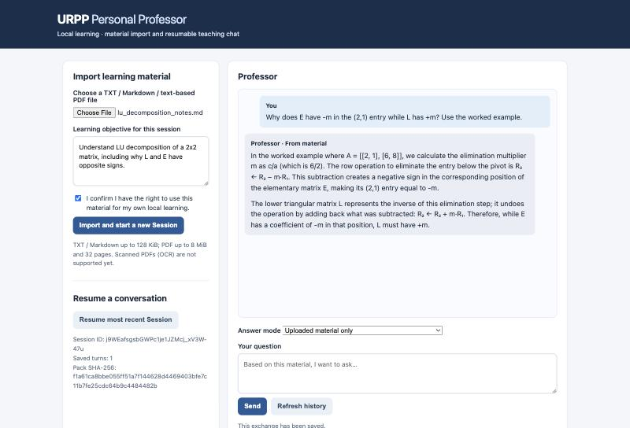
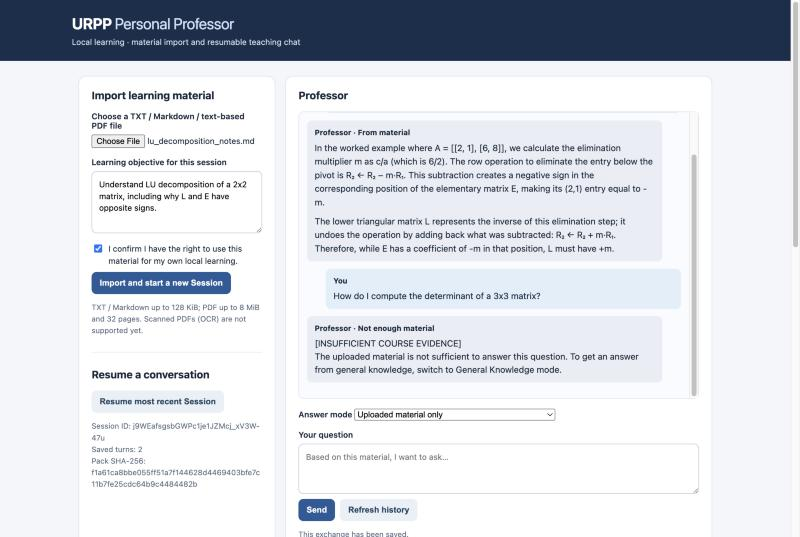
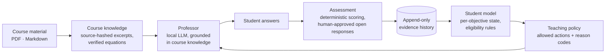

# URPP — Personal Professor

**An evidence-based AI tutor for university STEM courses: it decides what to teach next from what a student has actually shown, not from what a language model guesses.**


-555)


<p align="center">
  
  
</p>
<p align="center"><sub>Left: an answer grounded in the uploaded notes. Right: the same Professor declining a question the notes don't cover, instead of guessing. Both run on a local 4B model.</sub></p>

---

## The research question

Most AI tutors are a chatbot with a course document attached. They answer well, but they cannot say *what the student has learned*, they treat "answered correctly after a hint" the same as mastery, and they decide what to do next by asking the same model that writes the explanation.

URPP asks:

> **Can an AI tutor that adapts to a student's *demonstrated* understanding help them learn more effectively and study more independently than a standard course chatbot?**

To make that question testable, URPP separates three jobs that a chatbot mixes together:

| Role | Job | Decided by |
|---|---|---|
| **Learning analyst** | Turn answers into evidence and estimate what the student knows per learning objective | Deterministic rules over an append-only evidence history |
| **Teaching policy** | Choose the next teaching action (diagnose, review, hint, practice, self-explain, transfer) | An explicit, versioned rule policy, with a reason code for every choice |
| **Professor** | Explain, using only the student's course material | A language model, which is **not allowed** to change the student's record |

## Design principles

1. **Evidence history is the source of truth.** Student state is always *recomputed* from stored evidence, never edited directly.
2. **The language model proposes; code decides.** The model writes explanations. It cannot grant mastery, approve assessments, or skip eligibility rules.
3. **"Unknown" is a valid answer.** A correct answer after a hint, or with unknown conditions, does not count as independent mastery. The system says what it does not know.
4. **Every claim is traceable.** Source hashes, versioned rubrics and policies, frozen benchmark runs, and a written design record for each stage.

## See it work

**The evidence loop** (local numeric lesson, `scripts/run_local_numeric_lesson_v01.py`): the student asks for a hint, then answers correctly. URPP records both, keeps mastery `unknown` because the answer was assisted, and changes the next action to a conceptual review.

```text
Initial Student State: unknown
Assessment Action: diagnostic_assessment
Question: What is 2 + 3?

Your input > hint
[HINT] Start at 2 and count three more: one step, two steps, three steps.
Assistance event recorded: hint, source=application_reported

Your input > 5
=== RECOVERED STUDENT STATE ===
State: unknown
Included Evidence: 0
Excluded Evidence Reasons: {'numeric-v02:…': 'assistance_level_unknown'}
Application-reported Assistance Events: 1

=== NEXT AUTOMATIC TEACHING TURN ===
Next Action: conceptual_review
```

**The course-grounded Professor** (screenshots above): import a TXT, Markdown, or PDF; ask questions; the Professor cites the material or explicitly declines. Requested equations from a paper are shown from a human-verified record instead of being re-typed by the model.

## How it works



| Area | Code | What it does |
|---|---|---|
| Student model | [`backend/app/services/student_model/`](backend/app/services/student_model) | Recomputes per-objective state from evidence; eligibility filters out assisted, misaligned, or invalid attempts |
| Assessment | [`backend/app/services/assessment/`](backend/app/services/assessment) | Numeric scoring, open-response review with signed approval, transfer-assessment review |
| Teaching policy | [`backend/app/services/decision/`](backend/app/services/decision) | Rule-based and evidence-driven action selection, student requests, recoverable sessions, shadow policies |
| Professor | [`backend/app/services/course_knowledge/`](backend/app/services/course_knowledge) | Material import, source selection, grounded chat, verified-equation route, math-fidelity benchmark |
| Persistence | [`backend/app/repositories/`](backend/app/repositories) | SQLite with atomic submissions, versioned items, guarded migrations |
| Models | [`backend/app/llm/`](backend/app/llm) | Local Ollama gateway (default `qwen3.5:4b`) and an OpenAI structured gateway |

## Results so far

**Math-fidelity benchmark (14E).** 8 frozen questions about equations in a CT-reconstruction paper; deterministic L1 checks plus human L2 review.

| Run | What changed | L1 pass | L1 fail |
|---|---|---:|---:|
| Baseline | Model re-types equations from PDF text | 60 | 4 |
| Verified-equation route | Equations shown from a human-verified record | 63 | 0 |
| English benchmark v0.2 | Same route, questions in English | 58 | 4 |

The honest reading: **showing verified equations fixes transcription, but the 4B model's *explanations* still contain math errors** (for example, putting a factor in the numerator instead of the denominator). L1 cannot catch this; human L2 review is pending. In the English run, all four failures come from one malformed model response. Details: [`docs/URPP_14F_revision_record_v01.md`](docs/URPP_14F_revision_record_v01.md).

**Engineering.** 1,400 backend tests; a recoverable session that survives restarts without double-submitting; and a full design record for each stage.

## Try it

Requires Python 3.11+ and [Ollama](https://ollama.com) for the local model.

```bash
git clone https://github.com/ZhenchengLin/URPP.git
cd URPP/backend
python -m venv .venv && source .venv/bin/activate
pip install -e ".[pdf,dev]"
ollama pull qwen3.5:4b
```

Run the Professor web app (local only, http://127.0.0.1:8765):

```bash
python -m app.local_learning_web_v01 --port 8765 --data-root ~/urpp-demo
```

The data folder must be private (`chmod 700 ~/urpp-demo`).

Run the evidence-loop lesson (creates a new SQLite file):

```bash
PYTHONPATH=. python ../scripts/run_local_numeric_lesson_v01.py --database /tmp/urpp-lesson.sqlite3
```

Run the tests:

```bash
python -m pytest -q
```

## Status and limitations

URPP is a **single-developer research prototype**, not a product.

- **Two halves not yet joined.** The evidence loop runs on numeric assignments, while the course-grounded Professor runs chat on a synthetic student state. Connecting them, so that chat produces evidence, is the next milestone.
- **No learning-outcome data yet.** No study with real students has been run, and no claim is made that URPP improves learning.
- **Local, single-user, no authentication.** Course materials never leave the machine.
- **Explanation quality depends on model size.** Larger local models are being evaluated.

## Roadmap and open research questions

- **Connect chat to evidence.** End each topic with a short check whose result enters the student model.
- **Course intelligence (Implementation 15).** Derive objectives, requirements, and a timeline from the syllabus instead of one generic objective.
- **Evaluation design.** Compare a standard chatbot, a single tutor with a student model, and the separated-roles design on understanding, retention, and independent study.
- **Open questions:**
  - How should assisted success be weighted?
  - When should a student's request override the policy?
  - How can explanation correctness be checked at scale?

## Documentation

- [Implementations 0–14: review and analysis](docs/URPP_00-14_review_and_analysis_v01.md): what was built, what is strong, and what is missing
- [Design records `docs/00`–`32`](docs): one document per stage, written before or alongside the code
- [Engineering archive](engineering-archive/chapters): chapter-by-chapter history with the bugs that really happened, kept apart from the defensive tests (open `engineering-archive/atlas/index.html` locally for the searchable version)
- [Implementation 15 taskbook](docs/URPP_15_course_timeline_syllabus_taskbook_v01.md): the next milestone

## Author

**Zhencheng Lin**, M.S. Electrical and Computer Engineering, UC Santa Cruz. If you work on intelligent tutoring, learning analytics, or AI in education and would like to discuss the project, please open an issue or reach out through GitHub.
